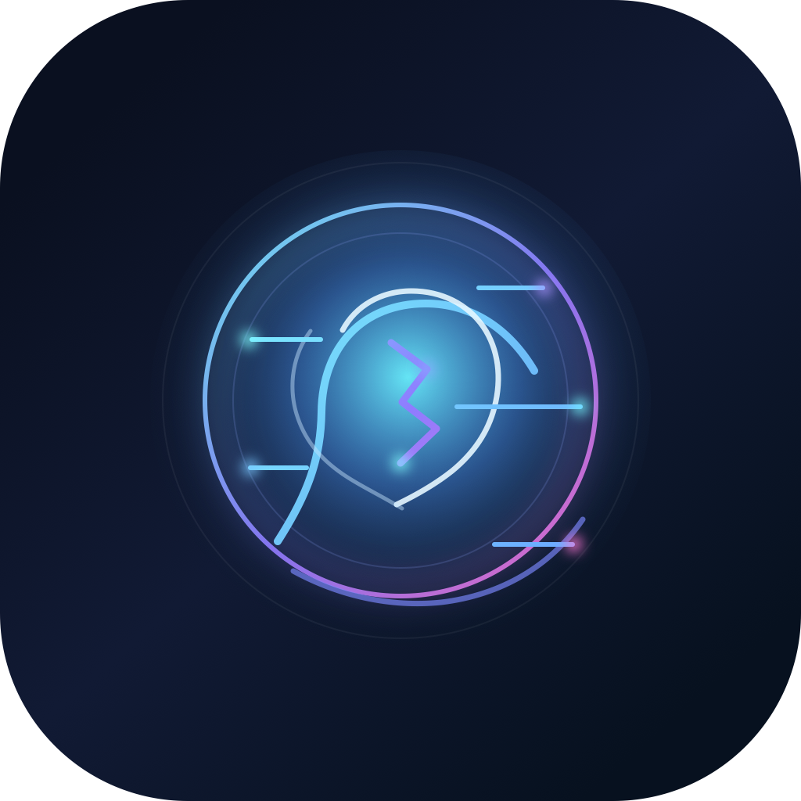

  
  <h1>Casey Rivera</h1>
  
<strong>AI and technology enthusiast</strong> exploring intelligent systems, creative tools, and practical innovation that improves human life.

  
I love experimenting with ideas, building useful technology, and learning how AI, automation, and thoughtful product design can help people do more meaningful work.

## About Me

I am energized by technology that feels both ambitious and useful.
The work that excites me most sits at the intersection of AI, automation, product thinking, and real human impact.

I enjoy exploring new tools, testing bold ideas, and turning curiosity into working systems people can actually use.

## What I Am Exploring

- Applied AI systems and agentic workflows
- Developer tools and modern product experiences
- Automation that helps people work smarter and create faster
- Full-stack experiments that turn concepts into practical products
- Human-centered technology with clear everyday value

## What I Care About

- Building technology that reduces friction
- Using AI to expand human capability, not replace it
- Making complex systems feel simple and useful
- Staying curious, hands-on, and always learning

## Current Focus

I am especially interested in how AI can support better thinking, faster creation, and more meaningful problem solving across work and life.

## Public Repositories

Here is a quick map of the public projects on this profile.

| Repository | Description |
| --- | --- |
| [ai-learning-channel-n8n-automation](https://github.com/riveracasey/ai-learning-channel-n8n-automation) | Review-first n8n automation workspace for AI Learning Channel Shorts production. |
| [playbook-platform-production-repo](https://github.com/riveracasey/playbook-platform-production-repo) | Production-ready Druva cyber resilience assessment platform with admin and reporting workflows. |
| [rfp-ai-project](https://github.com/riveracasey/rfp-ai-project) | Druva RFP AI platform for document intake, retrieval, draft response generation, review, and export. |
| [wifi-home-radar](https://github.com/riveracasey/wifi-home-radar) | WiFi and AI edge-perception experiments for sensing presence, movement, and health signals without cameras. |
| [openclaw](https://github.com/riveracasey/openclaw) | Personal AI assistant platform spanning chat channels, voice, tools, and local gateway workflows. |
| [deer-flow](https://github.com/riveracasey/deer-flow) | Exploration of DeerFlow 2.0 and agent orchestration for deep research and tool-using workflows. |
| [astradb-ragstack-demo](https://github.com/riveracasey/astradb-ragstack-demo) | Enterprise RAG sidekick demo using Astra DB, DataStax RAGStack, LangChain, and Streamlit. |
| [datastax-dbrecommendation](https://github.com/riveracasey/datastax-dbrecommendation) | Starter app for Astra DB-powered recommendations with a lightweight frontend and API. |
| [AzulIC](https://github.com/riveracasey/AzulIC) | Azul Intelligence Cloud evaluation lab for JVM inventory, CVE visibility, and runtime analysis. |
| [ransomware-workshop-repo](https://github.com/riveracasey/ransomware-workshop-repo) | Original downloaded ransomware workshop repository kept as a source snapshot. |
| [ransomware-workshop-downloaded](https://github.com/riveracasey/ransomware-workshop-downloaded) | Direct ManusAI file snapshot for ransomware workshop assets and references. |
| [RRR-workshop-manusai](https://github.com/riveracasey/RRR-workshop-manusai) | Archive-style ManusAI download repo for recovery and resilience workshop material. |
| [riveracasey](https://github.com/riveracasey/riveracasey) | This profile README and the AI-themed assets behind it. |

## Philosophy

I believe the best technology should make people feel more capable, more creative, and more connected to what matters.
